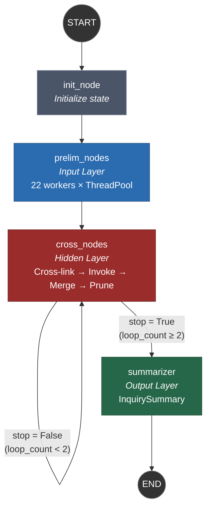
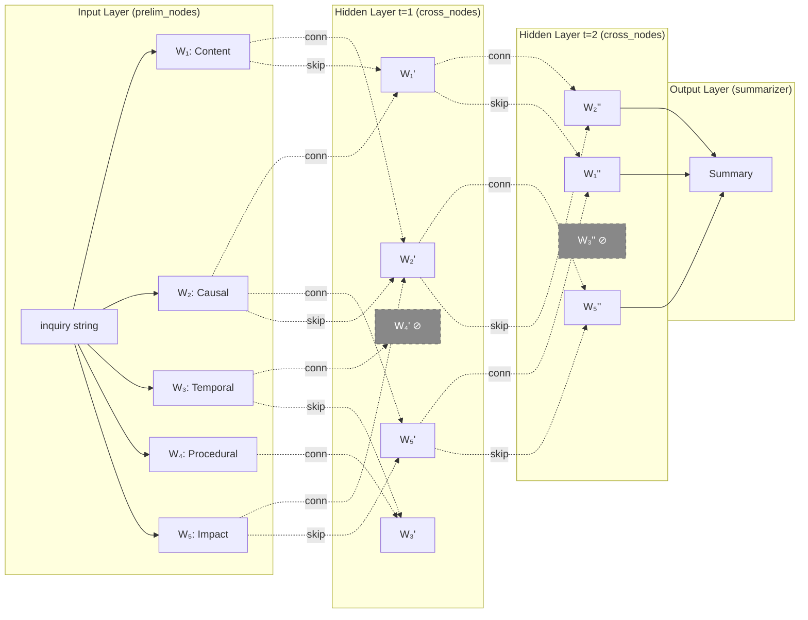

# A Multi-Agent System for Interrogative Decomposition of Human Inquiries Using LLM-Backed Sparse Dynamic Graphs

## Abstract

This paper presents the **MAS Inquiry Framework**, a multi-agent system implemented in Python using LangGraph that decomposes a single human inquiry into 22 parallel interrogative dimensions and processes them through a layered graph architecture structurally analogous to a sparse, dynamically pruned neural network with recurrent connections. Each dimension is served by a specialized worker agent backed by a large language model (LLM), producing structured answers with relevance scores, pairwise similarity scores, and cross-dimensional connections. The system employs an iterative refinement loop in which workers exchange information via data-dependent skip connections, merge overlapping answers through an LLM-prompted deduplication algorithm, and are selectively deactivated when a per-worker metric fails to improve — a mechanism analogous to metric-driven dropout in deep networks. A supervisor metric aggregates worker-level performance. After convergence or a fixed iteration budget, a summarizer agent synthesizes the surviving multi-dimensional answers into a single coherent output. The system was prototyped using Google's Antigravity IDE agent from a single natural-language prompt, then manually verified and refactored.

---

## 1. Introduction

When a human poses a question — say, *"Correct push-ups?"* — the apparent simplicity conceals a multi-dimensional information need. The inquiry simultaneously touches on procedural mechanics (*How?*), muscular physiology (*What?*), common errors (*What's Missing?*), injury risk (*Impact*), temporal pacing (*When?*), and emotional motivation (*Why?*). Traditional question-answering systems process such inputs monolithically: a single model generates a single response. The MAS Inquiry Framework takes a fundamentally different approach by decomposing the inquiry across 22 named interrogative dimensions, processing them in parallel, cross-linking them through data-driven connections, and iteratively refining the results through a merge-and-prune loop before synthesizing a final answer.

The framework is implemented as a LangGraph `StateGraph` [1] with four node types: an initialization node, an input-layer node (`prelim_nodes`), a hidden-layer node with recurrent edges (`cross_nodes`), and an output-layer node (`summarizer`). The graph's connectivity is not statically defined at compile time; it emerges dynamically at runtime from the LLM-generated `connections_list` of each worker, making the topology data-dependent. Workers that fail to improve under refinement are deactivated, yielding variable-depth execution paths. This combination of dynamic sparsity, recurrence, and metric-gated pruning distinguishes the system from conventional multi-agent orchestration patterns.

The interrogative decomposition itself extends the classical 5W1H framework (Who, What, When, Where, Why, How) — a structuring principle traceable to Hermagoras of Temnos (~150 BC) and formalized in journalism and rhetoric — to 22 dimensions organized into three tiers: base questions (10 dimensions), multimodal questions (6 dimensions), and hidden/meta-cognitive questions (6 dimensions). An additional catch-all worker (`InquiryOther`) ensures the decomposition satisfies the MECE principle (Mutually Exclusive, Collectively Exhaustive) [2].

The system was designed and initially generated using Google's Antigravity IDE coding agent from a single natural-language prompt — a roughly three-page specification containing the worker dimension tables, metric definitions in pseudocode, the graph workflow steps, and the Pydantic output schemas. The coding agent produced a working prototype in minutes. Manual refactoring over three evenings confirmed that the AI-generated solution was functional with only one bug, and no major architectural issues that would have prevented the system from working.

### 1.1 Contributions

1. A layered multi-agent graph architecture for inquiry processing that mirrors the structure of sparse neural networks operating on symbolic/linguistic data rather than floating-point activations.
2. A metric-driven worker deactivation scheme analogous to adaptive depth networks.
3. An LLM-prompted intra-worker deduplication and merging algorithm that enforces diversity among answers.
4. A formal decomposition of human inquiries into 22 interrogative dimensions with typed answer categories.

---

## 2. Architecture

### 2.1 System Overview

The MAS Inquiry Framework is orchestrated as a LangGraph `StateGraph` compiled with an `InMemorySaver` checkpointer. The graph consists of four nodes connected by deterministic and conditional edges:



The `cross_nodes` → `cross_nodes` recurrent edge is governed by a conditional function:

```python
lambda x: x["stop"]  # True → summarizer, False → cross_nodes
```

where `stop` is set to `True` when `loop_count >= 2`.

### 2.2 Neural Network Analogy

The graph's execution flow is structurally analogous to a feedforward neural network with dynamic sparsity, skip connections, and metric-gated recurrence. The following diagram illustrates this analogy for a simplified case with 5 out of 22 workers:



In this diagram:
- **Solid arrows** represent primary data flow (inquiry broadcast, final aggregation).
- **Dashed arrows labeled "conn"** represent sparse, data-dependent connections generated by each worker's `connections_list`. These are analogous to weighted edges in a neural network, but the weights are implicit in the relevance scores and the connectivity itself is determined at runtime by the LLM.
- **Dotted arrows labeled "skip"** represent residual/skip connections: the `InquiryReplyMerger` combines a worker's previous-iteration output with its current-iteration output, analogous to residual connections in deep networks [3].
- **Nodes marked ⊘** represent deactivated workers — workers whose merged metric did not exceed their previous metric. This is analogous to metric-driven dropout [4] or stochastic depth [5], except the deactivation is deterministic and conditioned on the worker metric rather than random.

### 2.3 Shared State

All nodes read from and write to a shared `AgentState` dictionary, which functions as a blackboard [6]:

| Field | Type | Description |
|---|---|---|
| `inquiry` | `str` | Original human input string |
| `active_workers` | `list[str]` | Currently active dimension names (initialized to all 22) |
| `deactivated_workers` | `list[str]` | Workers frozen due to metric stagnation |
| `loop_count` | `int` | Iteration counter for the recurrent hidden layer |
| `stop` | `bool` | Termination flag, set when `loop_count >= 2` |
| `worker_replies` | `dict[str, WorkerReply]` | Accumulated structured replies per dimension |
| `summary` | `str \| None` | Final synthesized output |

The `worker_replies` field uses a custom `merge_dict` reducer (via LangGraph's `Annotated` type) that merges dictionaries by key, allowing nodes to emit partial updates that are folded into the accumulated state.

---

## 3. Methodology

### 3.1 Worker Agent Design

Each of the 22 worker agents is a subclass of `BaseInquiryWorker` defined in [`inquiry_base.py`](../src/agents/workers/inquiry_base.py). A worker is characterized by four class-level attributes:

| Attribute | Example (`InquiryCausal`) |
|---|---|
| `dimension` | `"Causal"` |
| `primary_focus` | `"Motivation & Logic"` |
| `answer_types` | `["intent", "cause", "rationale", "justification"]` |
| `contextual_utility` | `"The Catalyst: Uncovers the underlying engine driving the behavior."` |

At invocation, the worker renders a Jinja2 prompt template (`BASE_PROMPT_TEMPLATE`) with its metadata and the current inquiry string injected. The prompt instructs the LLM to execute a deterministic optimization algorithm (described in Section 3.3) and return structured JSON conforming to the `WorkerReply` Pydantic schema.

### 3.2 Structured Output Schema

Every worker produces a `WorkerReply` object with three fields:

```python
class WorkerReply(BaseModel):
    answers_list: list[AnswerItem]        # up to N=5 answers
    similarity_scores: list[SimilarityScore]  # pairwise similarities
    connections_list: list[DimensionConnection]  # cross-links
```

where:

$$\text{AnswerItem} = (a_k, \; t_k, \; r_k) \quad \text{with } a_k \in \text{String}, \; t_k \in \mathcal{T}_d, \; r_k \in [0, 1]$$

$$\text{SimilarityScore} = (i, \; j, \; s_{ij}) \quad \text{with } i, j \in \{0, \ldots, N-1\}, \; s_{ij} \in [0, 1]$$

$$\text{DimensionConnection} = (i, \; d') \quad \text{with } i \in \{0, \ldots, N-1\}, \; d' \in \mathcal{D} \setminus \{d\}$$

Here $\mathcal{T}_d$ is the set of valid answer types for dimension $d$, $\mathcal{D}$ is the set of all 22 dimension names, and $N \leq 5$ is the maximum number of answers per worker.

### 3.3 Intra-Worker Answer Generation Algorithm

The prompt embeds a multi-step optimization algorithm that the LLM is instructed to execute. Let $\mathbf{A}$ denote the current answer list, $\tau$ the similarity threshold (default $\tau = 0.8$), $N_{\max}$ the maximum number of answers (default $N_{\max} = 5$), and $R_{\max}$ the maximum number of fill-up iterations (default $R_{\max} = 2$).

$$
\boxed{
\begin{aligned}
&\textbf{Algorithm 1: Worker Answer Generation} \\
&\text{Input: inquiry } q, \text{ dimension } d, \text{ threshold } \tau, \text{ limits } N_{\max}, R_{\max} \\[6pt]
&1.\quad \mathbf{A} \leftarrow \emptyset, \quad \ell \leftarrow 0 \\
&2.\quad \text{Generate up to } N_{\max} \text{ answers } \{(a_k, t_k, r_k)\}_{k=1}^{N_{\max}} \text{ relevant to } (q, d) \\
&3.\quad \text{Compute } s_{ij} = \text{sim}(a_i, a_j) \quad \forall\; i < j \text{ where } t_i = t_j \\
&4.\quad \text{For each answer type, select } (X, Y) = \arg\max_{(i,j): t_i = t_j} s_{ij} \\
&\qquad \textbf{if } s_{XY} > \tau: \\
&\qquad\quad Z \leftarrow \text{merge}(X, Y), \quad r_Z \leftarrow \text{relevance}(Z, q) \\
&\qquad\quad \textbf{if } r_Z > r_X \;\wedge\; r_Z > r_Y: \\
&\qquad\qquad \mathbf{A} \leftarrow (\mathbf{A} \setminus \{X, Y\}) \cup \{Z\} \\
&5.\quad \ell \leftarrow \ell + 1. \quad \textbf{if } \ell \geq R_{\max}: \text{ go to step 7} \\
&6.\quad \textbf{if } |\mathbf{A}| < N_{\max}: \text{ repeat from step 3} \\
&7.\quad \text{For each } a_k \in \mathbf{A}, \text{ propose connections } \{d'_m\}_{m=1}^{M_{\max}} \subset \mathcal{D} \setminus \{d\} \\
&8.\quad \textbf{return } (\mathbf{A}, \; \{s_{ij}\}, \; \text{connections})
\end{aligned}
}
$$

The algorithm incentivizes **diversity** by merging similar answers (reducing redundancy) and **coverage** by filling up to $N_{\max}$ after each merge. The relevance gate ($r_Z > r_X \wedge r_Z > r_Y$) prevents destructive merges.

### 3.4 Worker Metric

Each worker's output quality is quantified by a composite metric computed in the `calculate_worker_metric` function. Let $\mathbf{A}_d$ be the answer list for dimension $d$, $\mathbf{S}_d$ the similarity score list, and $\mathbf{C}_d$ the connections list. The worker metric is:

$$
M_d = \sqrt{|\mathbf{A}_d|} \;+\; \frac{1}{|\mathbf{A}_d|} \sum_{k=1}^{|\mathbf{A}_d|} r_k \;-\; \frac{1}{|\mathbf{S}_d|} \sum_{(i,j) \in \mathbf{S}_d} s_{ij} \;+\; \frac{|\mathbf{C}_d|}{|\mathbf{A}_d|}
$$

or equivalently:

$$
M_d = \underbrace{\sqrt{|\mathbf{A}_d|}}_{\text{volume}} \;+\; \underbrace{\bar{r}_d}_{\text{relevance}} \;-\; \underbrace{\bar{s}_d}_{\text{similarity}} \;+\; \underbrace{\frac{|\mathbf{C}_d|}{|\mathbf{A}_d|}}_{\text{connectivity}}
$$

The four terms encode competing optimization pressures:

| Term | Symbol | Effect | Analogy |
|---|---|---|---|
| Volume | $\sqrt{\lvert\mathbf{A}_d\rvert}$ | Rewards more answers (concave to diminish marginal returns) | Number of active neurons |
| Relevance | $\bar{r}_d$ | Rewards answers pertinent to the inquiry | Signal strength |
| Similarity | $-\bar{s}_d$ | Penalizes redundant answers | Regularization |
| Connectivity | $\lvert\mathbf{C}_d\rvert / \lvert\mathbf{A}_d\rvert$ | Rewards cross-dimensional linking | Synaptic density |

The metric is bounded: for $N_{\max} = 5$, $M_{\max} = 3$ connections per answer, and all scores in $[0, 1]$:

$$
M_d \in [0, \; \sqrt{5} + 1 - 0 + 3] = [0, \; 6.236]
$$

### 3.5 Reply Merging Algorithm

When the hidden layer produces a new reply for dimension $d$ and a previous reply exists, the `InquiryReplyMerger` agent merges them. Let $\mathbf{A}^{(t-1)}_d$ and $\mathbf{A}^{(t)}_d$ denote the previous and current answer lists. The merger prompt instructs:

$$
\boxed{
\begin{aligned}
&\textbf{Algorithm 2: Reply Merge} \\
&\text{Input: } \mathbf{A}^{(t-1)}_d, \; \mathbf{A}^{(t)}_d, \; \tau, \; N_{\max} \\[6pt]
&1.\quad \mathbf{A} \leftarrow \mathbf{A}^{(t-1)}_d \cup \mathbf{A}^{(t)}_d, \quad \ell \leftarrow 0, \quad R_{\max} \leftarrow \max(0, |\mathbf{A}| - N_{\max}) \\
&2.\quad \text{Compute } s_{ij} \quad \forall\; i < j \text{ where } t_i = t_j \\
&3.\quad \text{Select } (X, Y) = \arg\max_{(i,j): t_i = t_j} s_{ij} \\
&\qquad \textbf{if } s_{XY} > \tau: \\
&\qquad\quad Z \leftarrow \text{merge}(X, Y), \quad r_Z \leftarrow \text{relevance}(Z, q) \\
&\qquad\quad \textbf{if } r_Z > r_X \;\wedge\; r_Z > r_Y: \\
&\qquad\qquad \mathbf{A} \leftarrow (\mathbf{A} \setminus \{X, Y\}) \cup \{Z\} \\
&\qquad\qquad \text{Update connections: drop } C_X, C_Y; \text{ add } C_Z \\
&4.\quad \ell \leftarrow \ell + 1. \quad \textbf{if } \ell \geq R_{\max}: \text{ stop} \\
&5.\quad \textbf{if } |\mathbf{A}| > N_{\max}: \text{ repeat from step 3} \\
&6.\quad \textbf{return } (\mathbf{A}, \; \{s_{ij}\}, \; \text{connections})
\end{aligned}
}
$$

The key difference from Algorithm 1 is directionality: Algorithm 1 fills *up to* $N_{\max}$ (expansion), while Algorithm 2 reduces *down to* $N_{\max}$ (compression). The `max_removals` parameter is dynamically set to $\max(0, |\mathbf{A}^{(t-1)}_d| + |\mathbf{A}^{(t)}_d| - N_{\max})$.

### 3.6 Metric-Gated Worker Pruning

After merging, the system computes the metric of the merged reply and compares it to the previous iteration's metric:

$$
\text{decision}_d^{(t)} = \begin{cases}
\textbf{keep} & \text{if } M_d^{(t)} > M_d^{(t-1)} \\[4pt]
\textbf{deactivate} & \text{if } M_d^{(t)} \leq M_d^{(t-1)}
\end{cases}
$$

A deactivated worker is added to `deactivated_workers` and excluded from future connection routing in subsequent iterations. This implements a form of **deterministic adaptive depth**: the effective depth of the graph varies per worker depending on whether cross-dimensional refinement improves output quality. In neural network terms, this is analogous to stochastic depth [5] where the stochasticity is replaced by a metric gate.

### 3.7 Supervisor Metric

The global quality of the system is captured by the supervisor metric, computed by `InquirySupervisor.calculate_metric` in [`inquiry_supervisor.py`](../src/agents/supervisors/inquiry_supervisor.py):

$$
M_{\text{sup}} = \sqrt{\left|\{d \in \mathcal{D} : |\mathbf{A}_d| > 0\}\right|} \;+\; \sum_{d \in \mathcal{D}} M_d
$$

The first term rewards breadth (how many dimensions contributed at least one answer), while the second aggregates per-worker quality. For the full 22-dimension system:

$$
M_{\text{sup}} \in [0, \; \sqrt{22} + 22 \times 6.236] = [0, \; 141.9]
$$

### 3.8 Graph Execution Flow

The complete execution of the graph proceeds as follows. Let $T_{\max} = 2$ denote the maximum number of hidden-layer iterations.

$$
\boxed{
\begin{aligned}
&\textbf{Algorithm 3: Graph Execution} \\
&\text{Input: inquiry string } q \\[6pt]
&1.\quad \texttt{init\\_node}: \;\mathcal{W}_{\text{active}} \leftarrow \mathcal{D}, \; \mathcal{W}_{\text{dead}} \leftarrow \emptyset, \; t \leftarrow 0 \\
&2.\quad \texttt{prelim\\_nodes}: \;\text{For each } d \in \mathcal{W}_{\text{active}} \text{ (parallel):} \\
&\qquad R_d^{(0)} \leftarrow \text{Worker}_d(q) \quad \text{[Algorithm 1]} \\
&3.\quad \texttt{cross\\_nodes}: \\
&\qquad 3a.\quad \text{Collect connections: } \forall\, (i, d') \in \bigcup_d R_d^{(t)}.\text{connections}: \\
&\qquad\qquad\quad \text{route answer } R_d^{(t)}.\mathbf{A}[i] \text{ to dimension } d' \text{ if } d' \notin \mathcal{W}_{\text{dead}} \\
&\qquad 3b.\quad \text{For each target } d' \text{ (parallel):} \\
&\qquad\qquad\quad \tilde{R}_{d'}^{(t+1)} \leftarrow \text{Worker}_{d'}(q, \;\text{context from routed answers}) \\
&\qquad 3c.\quad \text{For each } d' \text{ (parallel):} \\
&\qquad\qquad\quad R_{d'}^{(t+1)} \leftarrow \text{Merge}(R_{d'}^{(t)}, \tilde{R}_{d'}^{(t+1)}) \quad \text{[Algorithm 2]} \\
&\qquad 3d.\quad \forall d': \; \textbf{if } M_{d'}^{(t+1)} \leq M_{d'}^{(t)}: \; \mathcal{W}_{\text{dead}} \leftarrow \mathcal{W}_{\text{dead}} \cup \{d'\} \\
&\qquad 3e.\quad t \leftarrow t + 1. \;\textbf{if } t \geq T_{\max}: \text{ go to step 4. Else: repeat step 3.} \\
&4.\quad \texttt{summarizer}: \; \text{summary} \leftarrow \text{InquirySummary}(q, \; \{R_d^{(\cdot)}\}_{d \in \mathcal{D}}) \\
&5.\quad \textbf{return } \text{summary}
\end{aligned}
}
$$

All worker invocations within a single step (2, 3b, 3c) are parallelized via Python's `ThreadPoolExecutor`.

---

## 4. Interrogative Dimensions

The 22 dimensions are organized into three tiers reflecting different levels of abstraction.

### 4.1 Base Dimensions (10)

These correspond to the classical interrogative pronouns extended beyond the traditional 5W1H:

| Question | Dimension | Primary Focus | Answer Types |
|---|---|---|---|
| What? | Content | Essence & Identity | object, entity, definition, category |
| Who? | Agent | Actors & Roles | person, animal, stakeholder, victim |
| When? | Temporal | Timing & Flow | time, duration, frequency, era, pace |
| Where? | Spatial | Location & Setting | context, environment, coordinate, layout |
| Why? | Causal | Motivation & Logic | intent, cause, rationale, justification |
| How? | Procedural | Method & Flow | mechanism, process, instrument, manner |
| How Much? | Quantitative | Magnitude | scale, mass, budget, threshold, count |
| Which? | Selective | Distinction | selection, preference, criteria, priority |
| So What? | Impact | Consequence | implication, significance, value, risk |
| What Next? | Actionable | Iteration | action, recommendation, follow-up |

### 4.2 Multimodal Dimensions (6)

These target sensory and measurement modalities:

| Question | Dimension | Primary Focus | Answer Types |
|---|---|---|---|
| How It Sounds? | Auditory | Sonic Signature | pitch, timbre, volume, resonance |
| How It Looks? | Visual | Appearance | color, shape, texture, composition |
| How It Moves? | Kinetic | Dynamic State | velocity, trajectory, fluidity, blur |
| How It Feels? | Tactile | Physical Surface | pressure, temperature, friction, weight |
| What Signal? | Measured | Data Telemetry | voltage, frequency, latency, variance |
| What Mood? | Affective | Emotional State | valence, arousal, sentiment, vibe |

### 4.3 Meta-Cognitive Dimensions (6)

These interrogate the inquiry itself — its gaps, biases, and latent assumptions:

| Question | Dimension | Primary Focus | Answer Types |
|---|---|---|---|
| What's Missing? | The Void | Omission | absence, silence, blind spot, gap |
| Whose View? | Perspective | Bias & Lens | framing, subjectivity, cultural filter |
| What If? | Hypothetical | Counterfactual | simulation, alternative, prediction |
| Is it Right? | Ethical | Moral Value | equity, privacy, consent, integrity |
| How Likely? | Probabilistic | Certainty | confidence level, risk, entropy |
| What's Under? | Subtext | Latent Meaning | innuendo, symbology, unspoken rule |

### 4.4 The Residual Worker

The `InquiryOther` worker acts as a catch-all node. When the LLM generates dimension connections targeting a dimension name not in the predefined set $\mathcal{D}$, the `get_worker_class` function in `inquiry_bot.py` falls back to creating an `InquiryOther` instance with the unknown dimension name dynamically assigned. This ensures the system is collectively exhaustive — no information is lost to unmapped dimensions. In statistical modeling terms, this is analogous to the residual term $\epsilon$ in a linear regression model:

$$
y = \sum_{d \in \mathcal{D}} \beta_d \cdot x_d + \epsilon
$$

where $\epsilon$ captures variance not explained by the named dimensions.

---

## 5. Implementation

### 5.1 Technology Stack

| Component | Technology |
|---|---|
| Orchestration | LangGraph `StateGraph` with `InMemorySaver` checkpointer |
| LLM | Google Gemini (`gemini-2.5-flash-lite` via `langchain-google-genai`) |
| Structured Output | Pydantic `BaseModel` schemas with `with_structured_output()` |
| Prompt Rendering | Jinja2 templates |
| Parallelism | `concurrent.futures.ThreadPoolExecutor` |
| CLI | `argparse` with streaming output via `graph.stream()` |

### 5.2 File Structure

```
src/
├── cli.py                              # CLI entry point
├── graphs/
│   └── inquiry_bot.py                  # LangGraph state graph definition
└── agents/
    ├── supervisors/
    │   └── inquiry_supervisor.py        # Supervisor metric calculation
    └── workers/
        ├── inquiry_base.py              # BaseInquiryWorker + all 22 worker classes
        ├── inquiry_reply_merger.py       # InquiryReplyMerger agent
        └── inquiry_summary.py           # InquirySummary agent
```

### 5.3 LLM Invocation Pattern

All LLM calls follow a uniform pattern:

1. Render a Jinja2 prompt template with dimension-specific metadata and the inquiry string.
2. Create a structured LLM via `llm.with_structured_output(WorkerReply)`.
3. Invoke with `[SystemMessage(content=prompt), HumanMessage(content=trigger)]`.
4. The LLM returns a Pydantic object conforming to `WorkerReply`.

The `temperature` is set to `0` to maximize determinism, and all worker invocations within a layer are parallelized.

---

## 6. Usage

The system is invoked via a CLI:

```bash
python -m src.cli --query "Correct push-ups?"
```

Execution streams node-by-node updates to stdout. For example, the `prelim_nodes` output shows each of the 22 workers reporting structured answers with relevance scores, similarity scores, and dimension connections. The `cross_nodes` iterations show refinement and deactivation events. The final `summarizer` output is a synthesized natural-language summary integrating all surviving dimensional perspectives.

---

## 7. Related Work

The MAS Inquiry Framework synthesizes concepts from several research traditions. The following table maps each architectural element to its primary intellectual antecedent:

| Framework Element | Classical Analogue | Key Reference |
|---|---|---|
| Shared state orchestration | Blackboard Architecture | Erman et al., 1980 [6] |
| Specialist agent ensemble | Society of Mind | Minsky, 1986 [7] |
| Dynamic expert routing | Mixture of Experts | Jacobs et al., 1991 [8] |
| Cross-worker connections | Spreading Activation | Collins & Loftus, 1975 [9] |
| Worker deactivation | Stochastic Depth / Pruning | Huang et al., 2016 [5]; LeCun et al., 1989 [10] |
| Reply merging (skip connections) | Residual Learning | He et al., 2015 [3] |
| 22-dimension decomposition | Extended 5W1H | Hermagoras of Temnos, ~150 BC |
| MECE catch-all worker | Residual term | Minto, 1987 [2] |
| Parallel pipeline QA | DeepQA / Watson | Ferrucci et al., 2010 [11] |

The most distinctive aspect of this system is that the "neurons" are LLM-prompted agents operating on symbolic/linguistic data rather than differentiable functions operating on floating-point vectors. The "activations" are structured text answers, and the "weights" are implicit in the LLM's prompt and parameters. This raises a question that motivated the original design: were the biology analogies and neural network design ideas from the past — sparse connectivity, skip connections, dynamic depth — never supposed to operate exclusively on floating-point numbers as inputs, weights, and outputs?

---

## 8. Conclusion

The MAS Inquiry Framework demonstrates that neural-network-inspired design patterns — sparse connectivity, skip connections, metric-gated pruning, and layered information flow — can be transposed from the domain of numerical optimization to symbolic multi-agent orchestration. The system decomposes human inquiries across 22 interrogative dimensions, processes them through a dynamically reconfiguring graph, and synthesizes a multi-perspective summary. The architecture's reliance on LLM-backed structured output (via Pydantic schemas and Jinja2 templates) means that both the graph topology and the answer quality are emergent properties of the interaction between the prompt design and the language model's capabilities.

The system was generated from a single prompt using Google's Antigravity IDE agent and subsequently verified through manual refactoring, suggesting that the combination of well-structured instructions and agentic code generation can produce architecturally sound multi-agent systems with minimal manual intervention.

---

## References

[1] LangGraph. "LangGraph: Build Stateful, Multi-Actor Applications with LLMs." https://github.com/langchain-ai/langgraph

[2] Minto, B. (1987). *The Pyramid Principle: Logic in Writing and Thinking*. Minto International. https://archive.org/details/pyramidprinciple0000mint

[3] He, K., Zhang, X., Ren, S. & Sun, J. (2015). "Deep Residual Learning for Image Recognition." *arXiv:1512.03385*. https://doi.org/10.1109/CVPR.2016.90

[4] Srivastava, N. et al. (2014). "Dropout: A Simple Way to Prevent Neural Networks from Overfitting." *Journal of Machine Learning Research*, 15, 1929–1958. https://jmlr.org/papers/v15/srivastava14a.html

[5] Huang, G. et al. (2016). "Deep Networks with Stochastic Depth." *European Conference on Computer Vision (ECCV)*. https://doi.org/10.1007/978-3-319-46493-0_39

[6] Erman, L.D., Hayes-Roth, F., Lesser, V.R. & Reddy, D.R. (1980). "The Hearsay-II Speech Understanding System: Integrating Knowledge to Resolve Uncertainty." *Computing Surveys*, 12(2), 213–253. https://doi.org/10.1145/356810.356816

[7] Minsky, M. (1986). *The Society of Mind*. Simon & Schuster. https://www.simonandschuster.com/books/Society-Of-Mind/Marvin-Minsky/9780671657130

[8] Jacobs, R.A., Jordan, M.I., Nowlan, S.J. & Hinton, G.E. (1991). "Adaptive Mixtures of Local Experts." *Neural Computation*, 3(1), 79–87. https://doi.org/10.1162/neco.1991.3.1.79

[9] Collins, A.M. & Loftus, E.F. (1975). "A Spreading-Activation Theory of Semantic Processing." *Psychological Review*, 82(6), 407–428. https://doi.org/10.1037/0033-295X.82.6.407

[10] LeCun, Y., Denker, J.S. & Solla, S.A. (1989). "Optimal Brain Damage." *Advances in Neural Information Processing Systems 2 (NeurIPS)*. https://proceedings.neurips.cc/paper/1989/hash/6c9882bbac1c7093bd25041881277658-Abstract.html

[11] Ferrucci, D. et al. (2010). "Building Watson: An Overview of the DeepQA Project." *AI Magazine*, 31(3), 59–79. https://doi.org/10.1609/aimag.v31i3.2303

